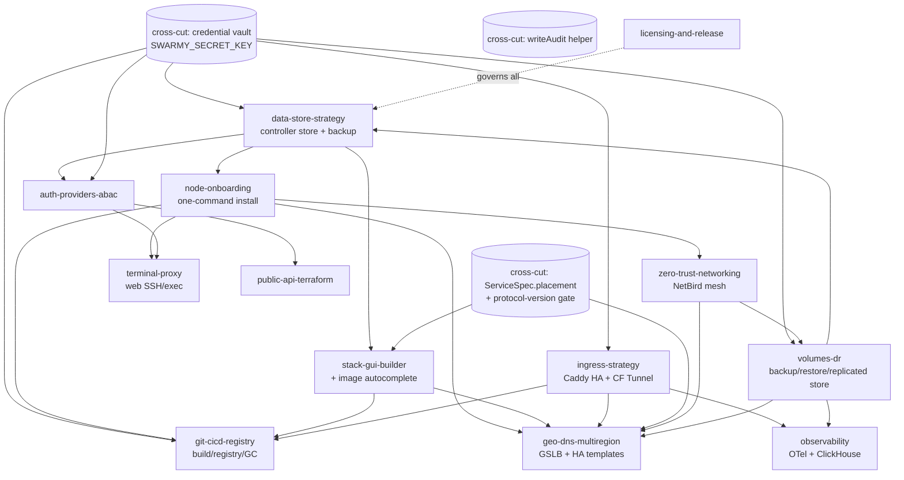

# swarmy — Execution Roadmap

> **Superseded (2026-07)** as the forward plan by
> [`plans/roadmap-mini-cloud.md`](./roadmap-mini-cloud.md) — the phases below
> are substantially shipped. §5 (cross-cutting concerns) remains binding.

> Lead architect/PM roadmap synthesizing the 13 epic plan docs in `plans/`.
> Companion doc: `plans/RECOMMENDATIONS.md` (founder decisions).

## 1. Vision recap

swarmy is a modern, **unopinionated** Docker Swarm controller: a thin orchestration/UX layer where the controller never touches a node's Docker socket (the per-node agent dials out and applies generic intent), everything is org-scoped + audited, and every feature is pluggable and individually disableable. The product promise is **"anyone can just deploy — it has to be that simple"**: copy one line, paste it on a box, watch the node and your app come alive — with the escape hatch that every stack still runs on plain `docker stack deploy`.

## 2. Dependency graph

The whole estate rests on two foundation epics — **data-store-strategy** (every model/migration sits on it) and **node-onboarding** (the install/enroll path every node capability extends). A small set of horizontal primitives (secrets/credential vault, `ServiceSpec.placement`, audit-writer) are extracted early because four-plus epics block on them.

Reading the graph:
- **data-store-strategy** and **node-onboarding** unblock everything; nothing real ships before them.
- The **credential vault** (a tiny envelope-encryption helper, `SWARMY_SECRET_KEY`-derived) is shared by ingress (TLS/tunnel creds), git-cicd (tokens/registry creds), volumes-dr (restic/S3 creds), auth (OIDC secrets), and the controller-state backup. Build it once, in P0, as part of data-store-strategy. Do not let four epics each invent their own.
- **ServiceSpec.placement** (constraints/preferences/maxReplicasPerNode, protocol-version-gated) is a small additive protocol change that geo-dns and the GUI builder both hard-depend on. Land it early in P1.
- **volumes-dr** is depended on by both **data-store-strategy** (controller backup rides its restic/`BackupTarget` mechanism) and **observability** (ClickHouse is stateful). This creates a soft cycle DS↔VOL: resolve it by shipping the *backup primitive* (restic driver + `BackupTarget` + `SWARMY_SECRET_KEY`) as the first slice of volumes-dr, in P1, before the controller-backup slice of data-store consumes it.
- **zero-trust-networking** is a soft dependency for volumes-dr (off-site replication over mesh) and geo-dns (true cross-region failover) — not a hard blocker; both degrade gracefully without it.

## 3. Phased plan

Sequencing rule: get **"copy one line → app is live on the internet with HTTPS"** working end to end as fast as possible. That's onboarding + a working ingress + the GUI builder, with mesh close behind so multi-node-across-clouds also "just works."

### P0 — Foundation (now)

| Epic | Size | Rationale |
|---|---|---|
| **licensing-and-release** | M | Ratify the license + fix the release pipeline (multi-arch GHCR images for agent **and** controller, version-pinned `install.sh` as a release asset). Onboarding literally can't ship a one-liner without this producing the installer + images. Do the license-string fix (`FSL-1.1-ALv2`) and CI Postgres/lint/test gaps immediately. |
| **data-store-strategy** | L | Every model and migration sits on it. Ship the PGlite (lite) default + same-dialect Postgres upgrade path, **and** extract the shared credential-vault helper here. Controller backup/restore slice waits on the volumes-dr primitive (P1). |
| _cross-cut:_ credential vault + `writeAudit` helper | S | Extracted as part of data-store. Unblocks ingress/git/volumes/auth. `AuditLog` has zero writers today — add the first one. |

### P1 — "Anyone can just deploy" (the killer demo)

| Epic | Size | Rationale |
|---|---|---|
| **node-onboarding** | L | The headline. `curl … \| sh` → node ONLINE in the dashboard, Docker + agent + swarm-init handled, watch-it-connect UI. Everything downstream is a node capability that extends this installer. |
| **ingress-strategy** | L | Without ingress, "deployed" isn't "reachable." Ship Caddy default (auto-HTTPS), Caddy HA via shared Redis cert storage, and Cloudflare Tunnel for the no-public-IP majority. `none` stays the literal default. |
| **stack-gui-builder** | XL | The "deploy visually / paste a compose / it just works" surface, plus image autocomplete. Land Phase 0 (canonical `ServiceModel` spine) early — it de-risks everything that extends the spec. Includes the `ServiceSpec.placement` additive change. |
| **zero-trust-networking** | L | Makes "any box in any cloud/home joins one swarm, no inbound ports" true. MVP = NetBird default, one-command join over WireGuard. Slightly behind onboarding because it's an opt-in toggle, but it's what makes the demo work across clouds. |
| **volumes-dr** (backup primitive slice) | M | Ship restic + `BackupTarget` + per-volume backup/restore first (works on vanilla `local` volumes). This slice also unblocks the data-store controller-backup feature. Replicated store / CSI come in P2. |

### P2 — Platform completeness

| Epic | Size | Rationale |
|---|---|---|
| **git-cicd-registry** | XL | Closes the loop: `git push` → build (BuildKit) → in-swarm registry → deploy, with disk-safe GC. The "no external CI/registry needed" differentiator. Depends on onboarding, ingress (registry TLS), GUI builder (image field "build from git"), and the credential vault. |
| **volumes-dr** (replicated store + CSI slice) | L | Garage replicated S3 + opt-in Swarm CSI cluster volumes + restore-on-recovery. Builds on the P1 backup primitive; soft-needs mesh for off-site. |
| **auth-providers-abac** | L | Toggle-on social/SSO providers + Cedar ABAC over the existing role chain. Gates the public API and node-shell approval flows; pure controller-side. |
| **observability** | L | OTel + single ClickHouse store + native trace UI, per-stack opt-in. Needs the overlay network and volumes-dr (ClickHouse is stateful). High value but not blocking the core promise. |
| **terminal-proxy** | M | Web SSH/exec over the existing agent WS (new `/term/ws` duplex pipe). Main RCE path — depends on auth/ABAC for approval/MFA and node-shell gating. |

### P3 — Scale & ecosystem

| Epic | Size | Rationale |
|---|---|---|
| **geo-dns-multiregion** | XL | GSLB (CoreDNS + custom plugin) + HA DB templates. Depends on the most: ingress (health source), `ServiceSpec.placement`, mesh (cross-region failover), volumes-dr. Genuinely advanced; the long tail. |
| **public-api-terraform** | L | OpenAPI REST (zod-openapi over existing service layer) + Terraform provider + SDKs. Depends on auth/ABAC for key scoping. The IaC/ecosystem play — important for enterprise, not for "anyone can deploy." |

> Sizes: S ≈ days, M ≈ 1–2 wks, L ≈ 3–5 wks, XL ≈ 6+ wks, for one strong implementer. Several P1 epics can parallelize once onboarding + the credential vault land.

## 4. Killer features to lead marketing with

1. **One command, watch it connect.** Copy one line from the dashboard, paste on any fresh Linux box, and the node appears ONLINE in seconds — Docker, agent, supervisor, and swarm membership all handled. No flags, no env vars, no manager-vs-worker decision.
2. **Cross-cloud cluster, zero inbound ports.** Flip one toggle and that same one-liner joins boxes across AWS, a homelab, and a DR box into one encrypted WireGuard swarm — no public IPs, no VPCs, no firewall edits (NetBird mesh).
3. **`git push` → live HTTPS service, no external infra.** In-swarm BuildKit + in-swarm registry + auto-HTTPS ingress means a push becomes a running, TLS-fronted service with nothing rented from Docker Hub or a CI vendor.
4. **Paste your compose, deploy visually, never get locked in.** A GUI builder derived from the real Swarm schema with image autocomplete, two-way compose import/export, and a "view as `docker service create`" escape hatch — proving the unopinionated promise.
5. **One-click disaster recovery.** Volume backup/restore + restore-on-recovery + a controller-state backup with a user-held passphrase, so a dead controller restored on a new box re-adopts the existing swarm automatically.

(Lead with 1–3; 4 and 5 are the "and it's serious" proof points.)

## 5. Cross-cutting concerns every epic must respect

- **Security / RBAC / ABAC.** Every mutating tRPC procedure goes through `orgProcedure`/`adminProcedure` today and `abacProcedure` once auth-providers-abac lands; new routers must adopt the same chain from day one. New principal types (`apikey`, mesh peer, build `system` actor) must map onto the same policy model. Privileged paths — terminal node-shell, builds (arbitrary code exec), direct-stack-connect to Postgres — are off-by-default, gated by an explicit agent env flag (`SWARMY_ALLOW_EXEC`/`_NODE_SHELL`/`_BUILD`/`_MESH`), TTL'd, and always audited.
- **Multi-tenancy / org-scoping.** Everything is keyed by `orgId`; no cross-org data path. Config singletons follow the `IngressConfig` one-per-org pattern. Bundled stateful services (registry, ClickHouse, Redis, Garage) are swarm-wide infra but their *data and access* stay org-scoped. The hosted cloud tier must assume hostile co-tenancy (per-build isolation, per-org policy enforcement).
- **Agent protocol versioning.** The wire protocol is the system's contract; one repo-wide version == the protocol version (per licensing-release). New capabilities are **additive** discriminated-union message types + additive `ServiceSpec` fields, gated by the `protocolVersions` handshake so older agents reject unknown fields gracefully and never receive commands they can't run. Only bump `PROTOCOL_VERSION` when an existing message shape changes. The "agent applies generic intent" rule is inviolable: new capability = new render/command type + new driver, never an agent rewrite.
- **Credential handling.** One envelope-encryption mechanism (`SWARMY_SECRET_KEY`-derived), hash-or-encrypt-at-rest, never return secrets to the client (mirror the join-token posture). The wire carries secret *references* resolved at dispatch with short TTL, not persisted plaintext. All credential epics (ingress, git, volumes, auth, controller-backup) share it.
- **The audit trail.** `AuditLog` exists but has no writers today. The first `writeAudit` helper ships in P0; every epic's mutations (including `system`-actor automation: polls, webhooks, GC, schedulers) write to it.
- **Pluggability as the default shape.** Mesh, ingress, build, registry, storage, GSLB, telemetry, observability backend — all copy the `@swarmy/ingress` driver-registry + `RenderedConfig`/`DriverDispatch` pattern, with a `none`/no-op driver registered first so the default install runs zero extra processes.
- **Testing.** CI today runs no lint/test and starts no Postgres despite a localhost `DATABASE_URL` (latent bug — fix in P0). Required gates: protocol round-trip/discriminated-union parse tests, compose two-way golden round-trip corpus, ABAC policy unit tests, GC "never delete in-prod digest" tests, and an e2e that exercises the actual headline (`install.sh` → node ONLINE → deploy → reachable over ingress). The squash-merge PR title feeds semantic-release, so add a PR-title conventional-commit check.
- **Simplicity guardrail (non-negotiable).** Every epic ships with its feature **off by default** (`driver = none` / enable toggle) and a one-command/zero-config happy path. If a feature can't be enabled with a single dashboard toggle and works with sane defaults the user never configures, it isn't done.
